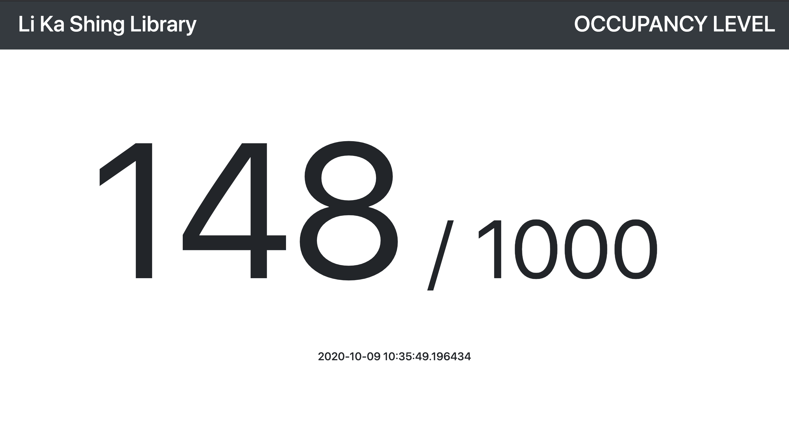
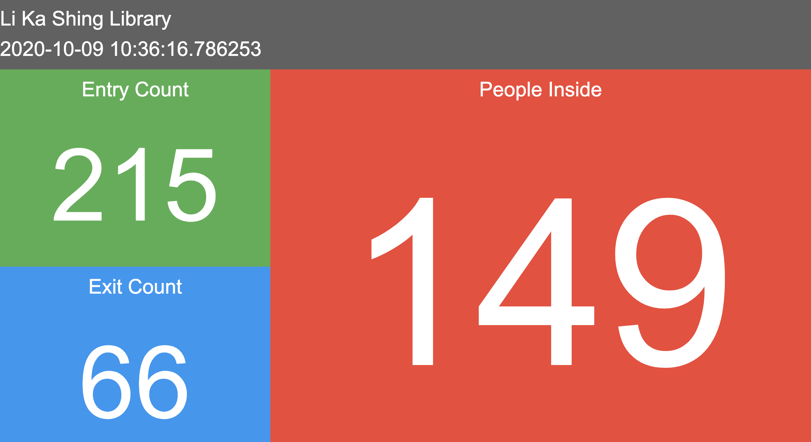
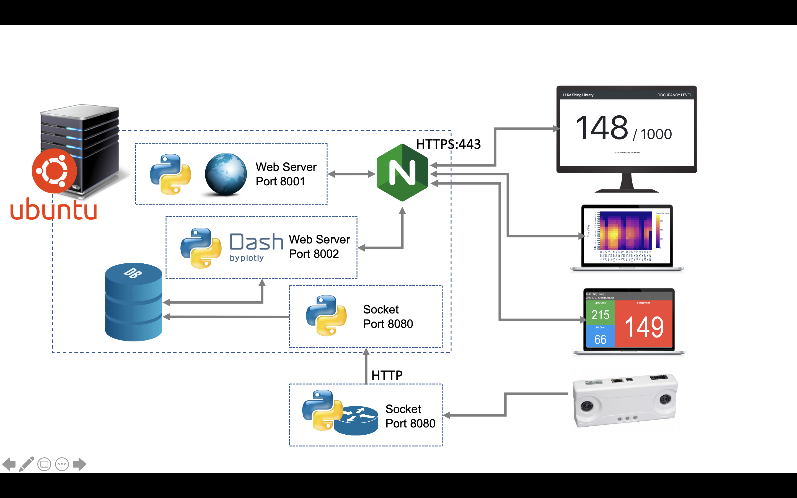

# PeopleCounter

## Background and Motivation:

In response to social distancing measures during COVID-19 pandemic, it has been imposed to limit the number of people in almost every location and educational institutions are not exempted to it. Hence the idea of counting the actual number of people inside the building became a requirement.

On each of library entrances (where I currently work), there are counters at the gate that logs each entry and exits. From these logs, reports are generated on a regular basis (monthly). However, this solution does not provide a live counter that can be viewed and monitored on a near real-time basis.
<br />

## The idea

Despite of having a simple requirement, I realized that none of the vendors we have can provide exactly what need. Not to mention the very high cost that comes with the solution.

In this regard, we decided to create our own solution. After checking our gate counters, I realized that there's a configuration to send the current count to a server via HTTP, however is it not being utilized. We played around the newly found feature/setting and set it to send update every 1 second to emulate near real-time couting.

<br />

## How it works:

Re-configurations are made to the entrances’ people counters to send update to a server every few seconds. From the server, the information is parsed, and calculations are made for the occupancy count. The information is then displayed in a browser that refreshes every few seconds as shown below: 

<p align="center">
  <kbd></kbd><br/>Fig 1: Used at entrance display <br />
</p>
<br />
<p align="center">
  <kbd></kbd><br />Fig 2: Backend Display (More details)<br />
</p>

Historical data are then saved on a Database and then displayed using Dash by Plotly module. Using heatmap chart on a daily and hourly basis we're be able to see the occupancy trends across several days.

<p align="center">
  <br />Fig 3: Heatmap <br /> 
</p>


## Overview

<p align="center">
  <br />Fig 4: Diagram <br /> 
</p>

## Initial Usage
1. Clone this repository
  ```
  $ git clone https://github.com/RonBulaon/PeopleCounter.git
  ```

2. Replace / Update the folloeing to match your environment.
  * Update the **<yourserver>** on files at public/*.html files
  * Sensor **IP address'**, **Schedule**, **Database name** and **Database credentials** at **config.conf**
  * If you want teams notification update **[msteams]** section at **config.conf**
  * Update script **/path/to/folder/**  at **checker.py** and **stopDashboard.py**
  * Update **<local_IP>** and **<remote_IP>** IPs at **forwarder.py**

2. Go to the downloaded repository's source folder and install the requirements.
  ```
  $ cd LiveOccupancyCounter
  $ pip install -r Requirements.txt
  ```

3. Execute script this way:  
  ```
  $ python3 checker.py
  $ python3 stopDashboard.py
  ```
  Note : 
  * **checker.py** and **stopDashboard.py** would start/restart the all running scripts every execution.
  * The these scripts can be used on cron to regularly check or restart he scripts if needed.

4. Run **forwarder.py** this will receive the count from sensors then forward it to port 8080 of the script above. This can be executed from same server or from remote. Just make sure that you have indicated the proper IP address' for remote and local.
  ```
  $ python3 forwarder.py
  ```
5. From your favorite browser opent he following:
  * https://domain.com/dashboard/
  * https://domain.com/public/lks.html
  * https://domain.com/public/kgc.html
  * https:/domain.com/public/kgc_detailed.html
  * https://domain.com/public/lks_detailed.html

## Other resources:
1. Ubuntu on [Azure](https://azuremarketplace.microsoft.com/en/marketplace/apps/Canonical.UbuntuServer?tab=Overview)
2. Nginx as [reverse proxy](https://docs.nginx.com/nginx/admin-guide/web-server/reverse-proxy/)
2. HTTPS setup through [Let's Encrypt](https://certbot.eff.org/lets-encrypt/ubuntubionic-nginx)


